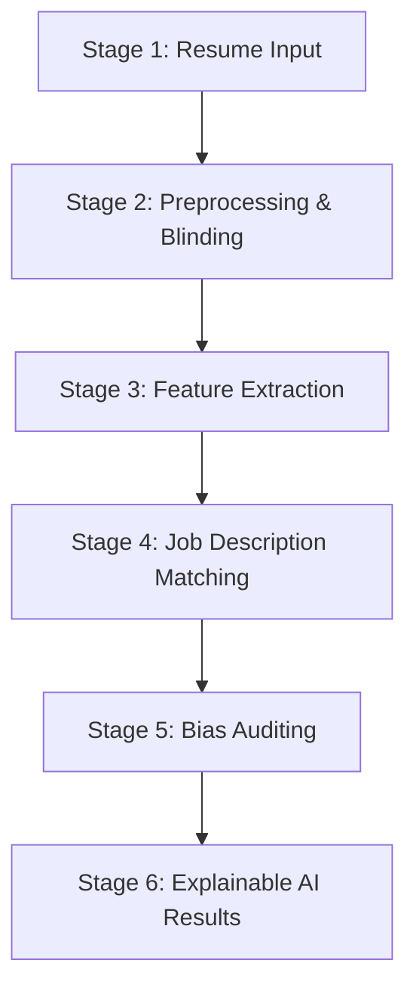

# AI-Powered Resume Screening & Bias Auditing System

A premium, production-ready AI Resume Screener and Fairness Auditing application built with Streamlit, Sentence-Transformers (BERT), Scikit-Learn, and Altair. The system is designed to automate candidate matching while actively auditing and mitigating demographic bias in hiring pipelines.

---

## 🔬 Core 6-Stage AI Pipeline

This system implements the full 6-stage AI hiring pipeline designed to ensure high accuracy and strict compliance with demographic fairness metrics:



1. **Resume Input**: Extracts unstructured text from PDF, DOCX, and TXT resume files.
2. **NLP Preprocessing & Blinding**: Sanitizes text (lowercasing, symbol scrubbing) and applies **Blind Screening** to strip out proxy variables for protected attributes (emails, phone numbers, pronouns, honorifics, and graduation years) before scoring.
3. **Feature Extraction**: Generates contextual neural embeddings using Sentence-BERT (`all-MiniLM-L6-v2`) and keyword n-gram vectors using TF-IDF.
4. **JD Cosine Matching**: Calculates semantic and keyword similarity against the Job Description. Applies education level weights (1–5) and experience duration heuristics.
5. **Demographic Bias Auditing**: Heuristically extracts gender indicators from the original text (names, honorifics, pronouns) *prior to blinding* to compute the selection rates, Average Match Scores, and the **Demographic Parity Difference (DPD)** across demographic groups.
6. **Explainable AI (XAI)**: Generates detailed candidate feedback profiles detailing **Profile Strengths**, **Profile Gaps (Weaknesses)**, **Actionable Improvement Tips**, and a **Hiring Recommendation** classification (Strong Hire, Consider, Weak Hire).

---

## 🛠️ Key Improvements & Bug Fixes

A series of functional, mathematical, and logical bugs present in the initial baseline codebase have been resolved:

* **Case-Sensitive Education Check**: Fixed a logic bug where `"be"` in `EDUCATION_KEYWORDS` matched common words like `"backend"`, `"become"`, and `"before"`, resulting in unqualified candidates being classified at Bachelor level (level 3). It now matches `"BE"` or `"B.E."` case-sensitively in the original text.
* **Skill Extraction Boundaries**: Updated the skill extraction regex boundary checks to support special characters (e.g. matching `c++` and `c#` without getting truncated by regex `\b` boundaries).
* **Experience Aggregation**: Rewrote the years-of-experience parser to scan all matches across multiple patterns and take the maximum duration, rather than stopping at the first small number encountered.
* **Consistent TF-IDF Scoring**: Patched the TF-IDF matching sequence to fit the vectorizer on the *entire batch* of candidates plus the Job Description before computing similarity, resolving an issue where candidate scores changed depending on their evaluation order.
* **BERT Matcher Fallback**: Fixed a mathematical dimension-mismatch crash (`ValueError`) that occurred in the fallback TF-IDF calculation path when `sentence-transformers` was missing.
* **Real-world Bias Auditing**: Replaced artificial random group assignment (`np.random.choice` with a static seed) with dynamic demographic gender estimation based on names and pronouns in the original resume.
* **Memory and Disk Leak Prevention**: Handled temporary file deletion immediately after evaluation within a `try/finally` block.

---

## 🖥️ UI/UX & Dashboard Redesign

The Streamlit interface was overhauled to feel like a modern, premium SaaS dashboard:
* **Custom Styling**: Injected a Plus Jakarta Sans and Outfit font configuration, modern shadows, layout paddings, and hover-lift transitions.
* **Metrics Panel**: Displays KPI metrics (Total Resumes, Shortlisted count, Avg ATS Score, Inferred Bias level) at a glance.
* **Altair Graphs**: Includes interactive charts showing match score distributions, skill frequencies, and selection/score statistics by demographic group.
* **Advanced Controls**: Adds text search filtering (by name/skills), range sliders (experience, match score), select boxes (education level), sorting options, and pagination (5 candidates per page).
* **HTML Profile Cards**: Features custom badge rings, check-marked skill tags, green strengths and red gaps columns, and scrollable preview text fields.

---

## 📂 Project Structure

```
resume_screening/
├── app.py                    ← Streamlit Web App (main entry point)
├── requirements.txt          ← Python package dependencies
├── README.md                 ← Project documentation (this file)
├── GUIDE.md                  ← Baseline project guide
├── src/
│   ├── __init__.py           ← Package initialization
│   ├── resume_parser.py      ← Stage 1 & 2: Text extraction + cleaning + heuristics
│   ├── matcher.py            ← Stage 3 & 4: BERT + TF-IDF similarity matcher
│   ├── bias_auditor.py       ← Stage 5: Demographic Parity Audit
│   ├── explainer.py          ← Stage 6: Strengths/Weaknesses and Recommendations
│   └── pipeline.py           ← Master pipeline coordinator
```

---

## 🔧 Installation & Setup

1. **Clone/Navigate to the workspace**:
   ```bash
   cd resume_screening
   ```

2. **Recreate the virtual environment**:
   ```bash
   python3 -m venv venv --clear
   source venv/bin/activate  # On Mac/Linux
   # venv\Scripts\activate  # On Windows
   ```

3. **Install the dependencies**:
   ```bash
   pip install -r requirements.txt
   ```

---

## 🚀 Running the Application

Launch the Streamlit app:
```bash
streamlit run app.py
```
This will start the local server. Open the application in your browser at:
🔗 **[http://localhost:8501](http://localhost:8501)**

*To check the redesigned layouts, click the **"Load Sample Data"** button in the sidebar and run the screening.*

---

## 🧪 Testing & Verification

To run the automated verification test suite checking for regex boundaries, education parsing, and fallback matching correctness:
```bash
python3 -m unittest discover -s src/ -p "*_test.py"  # Standard tests (if any)
# Or run the custom verification script:
python3 path/to/artifacts/scratch/test_pipeline.py
```
